# DataFlex LSP Server
Language server for the DataFlex programming language.

The following features are currently available:

#### Syntax Highlighting
Syntax highlighting with distinct colors for properties, methods, classes, constants etc.

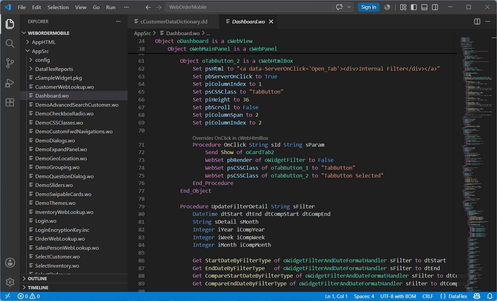

#### Code Completion
Code completion for methods, classes, variables, tables and columns, struct members etc.

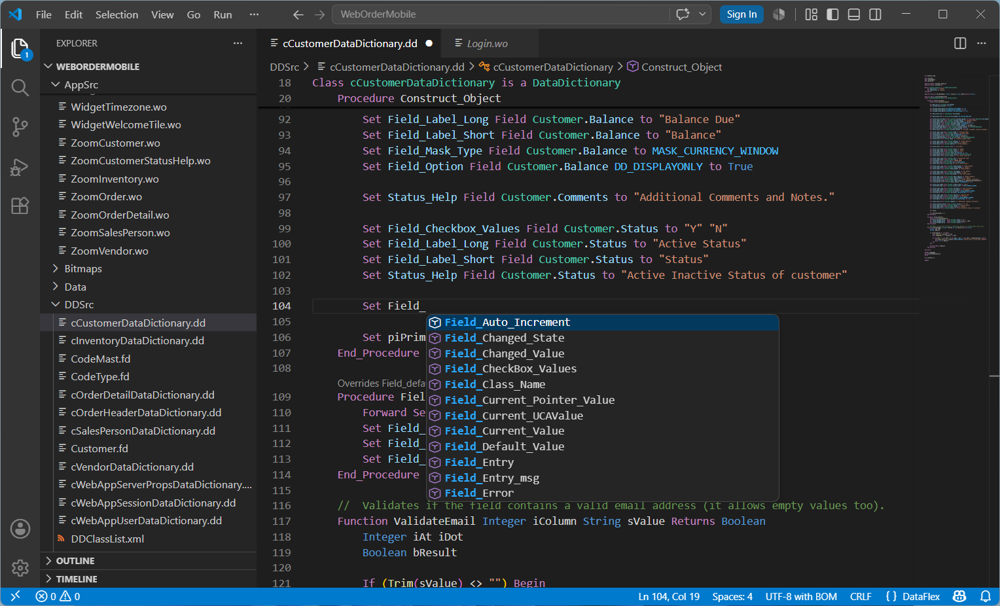

#### Goto Definition and Peek Definition
Goto definition and peek definition for methods, classes, objects, struct types etc.

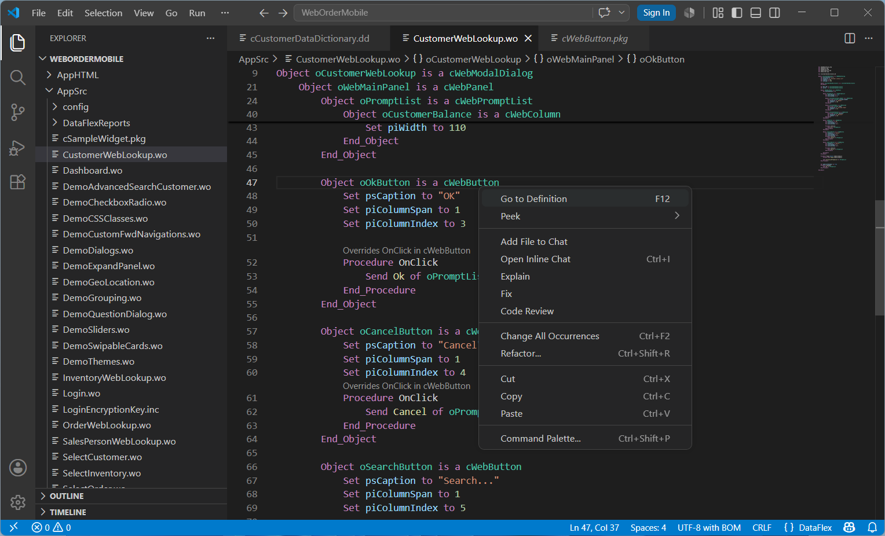 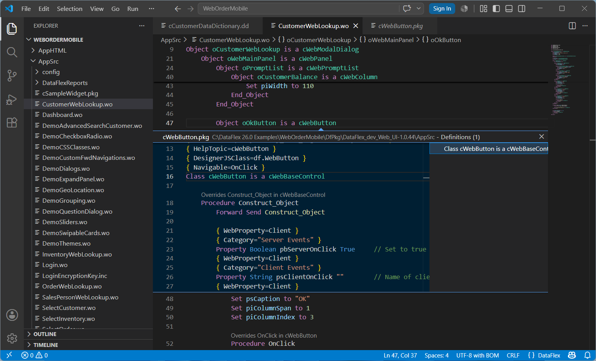

#### Code Lens
Code lens indicating method overrides.

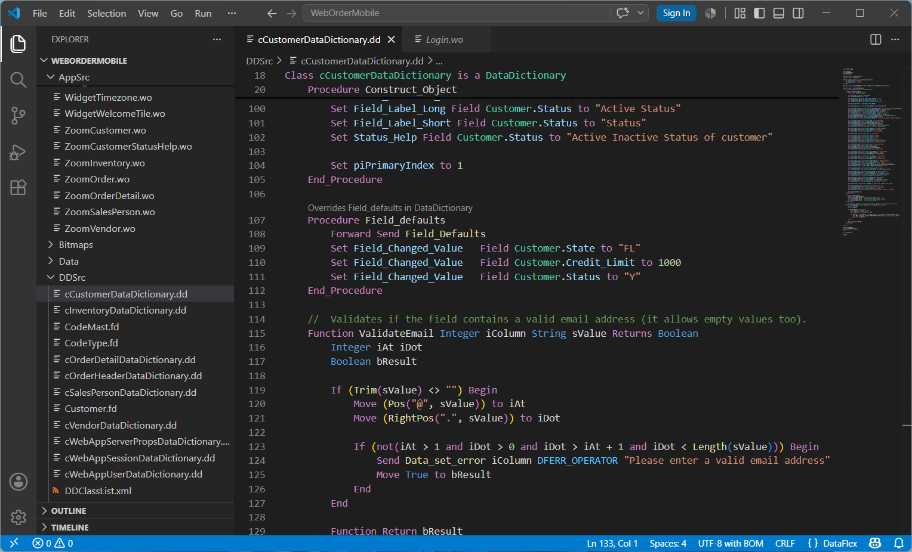

#### Method Signature and Parameter Help
Method signature and symbol information on mouse hover, and parameter information when typing a method call. 

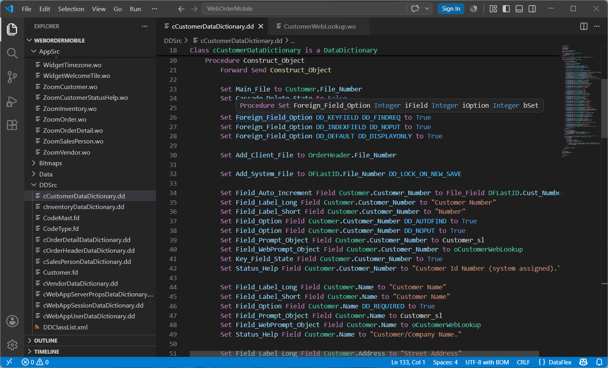 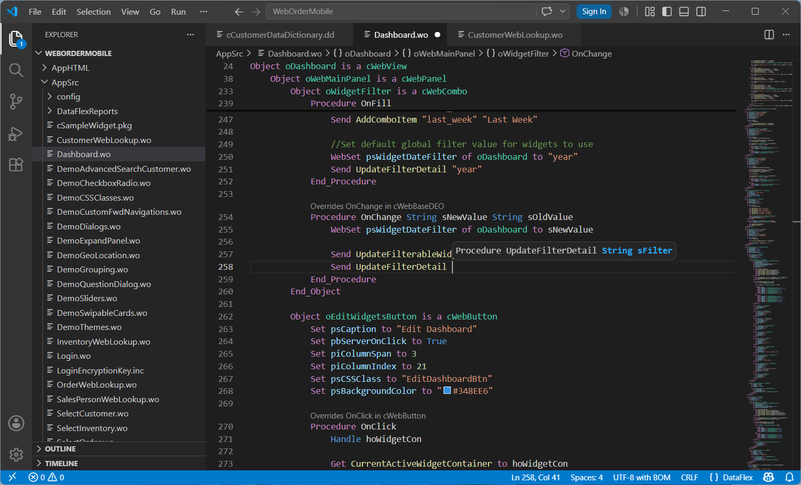

#### Document Symbols
Outline of document symbols for navigation within the document.

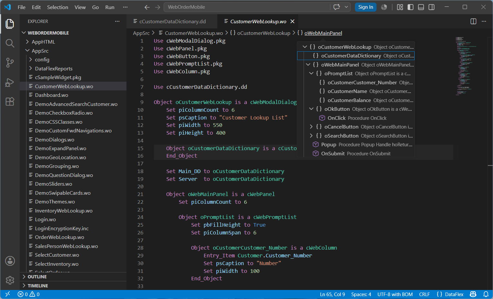 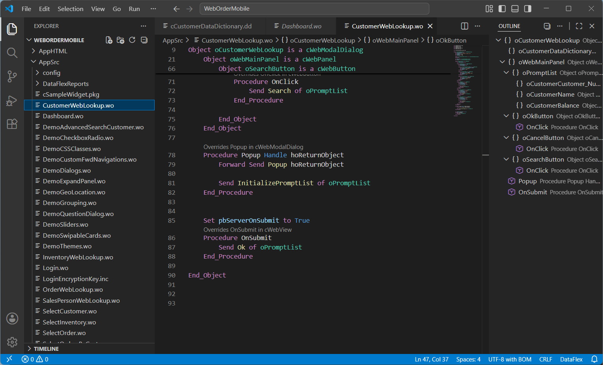

#### Workspace Symbols
All workspace symbols available for navigation between files across the workspace.

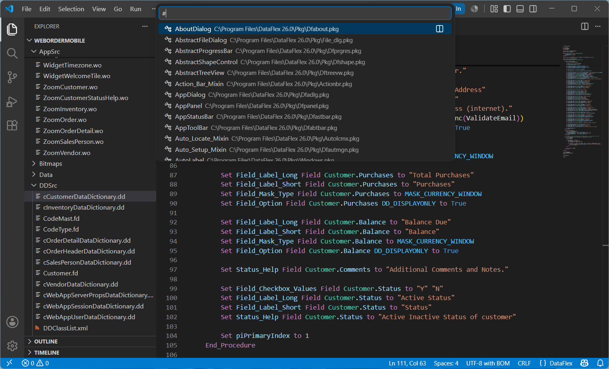 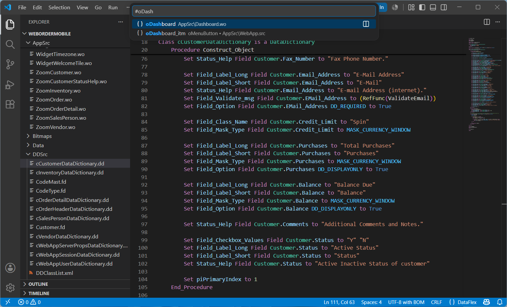

#### Current Limitations

- Fuzzy matching for workspace symbols not implemented yet, only strict case-sensitive prefix matching.
- Functions defined via `External_Function` and `Register_Function` not yet listed in code completion or goto definition.
- Packages not yet automatically fetched/updated when opening the workspace, workaround by compiling the project or running `df-cli`.
